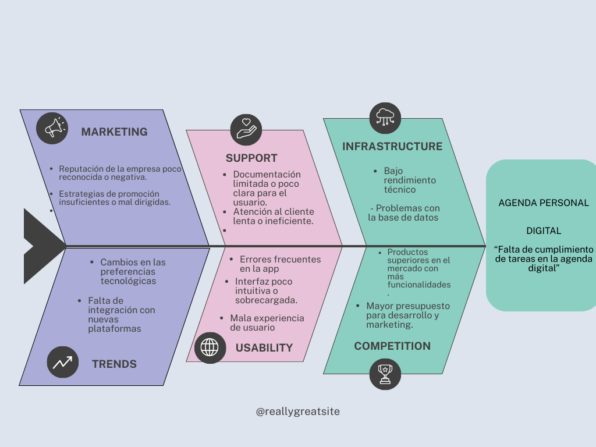

# Agenda Personal Digital

## propuesta-proyecto-grado
Repositorio que contendrá todo lo relacionado al proyecto final de grado de la tecnología en desarrollo de software.

###  Descripción
Aplicación web que permite a los usuarios organizar sus tareas y eventos diarios de forma sencilla y visual.

###  Funcionalidades
- Registro de tareas y eventos
- Visualización en calendario
- Filtros por fecha y prioridad
- Edición y eliminación de registros

###  Tecnologías
- HTML, CSS, JavaScript
- Backend: Node.js + Express
- Base de datos: SQLite o MongoDB

###  Estructura del repositorio
- `/frontend`: Interfaz de usuario
- `/backend`: API y lógica del servidor
- `/docs`: Documentación técnica

###  Cronograma sugerido
- Semana 1: Diseño de interfaz y base de datos
- Semana 2: Desarrollo de funcionalidades básicas
- Semana 3: Pruebas y mejoras
- Semana 4: Documentación y presentación

- # Diagrama de ishikawa del proyecto de aula

